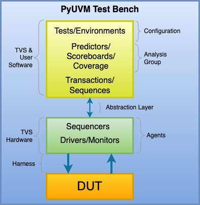
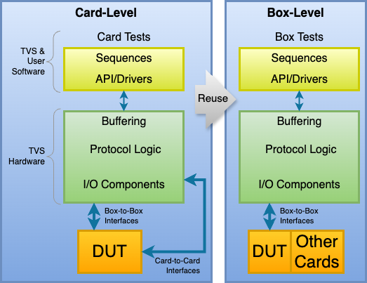

.. _tvs_concept:

Concept
=======

What is a *Total Verification System*?

When testing an electronics design's functionality, the interfaces of the design are the points where the test bench communicates with the :abbr:`DUT (Device Under Test)`.

.. list-table::
   :widths: 200 200

   * - .. image:: ../images/concept/basic-tb.png
     - As shown in this simplified diagram, the test bench stimulates the DUT's input interfaces and monitors the DUT's output interfaces.  The functionality implemented by the DUT is reflected in the DUT's output interfaces.

The TVS provides a programmable platform where the low-level interfaces (:abbr:`I/O (Input/Output)` components, protocol logic, buffers) are implemented in hardware, but the high-level tests, sequences, and :abbr:`API (Application Programming Interface)` /Drivers are implemented in software.  This approach allows the low-level interfaces to remain simple, powerful, and performant whereas the high-level test sequences are flexible, intelligent, and application-specific.  The diagram below illustrates this layered test bench approach with a loose mapping to the familiar :abbr:`OSI (Open Systems Interconnection)` model.

.. image:: ../images/concept/layered-tb.png
  :align: center

What makes the TVS different from other equipment is that test bench development starts in the world of simulation. The low-level interface blocks are implemented in programmable logic which becomes part of the simulation.  The high-level test bench is a combination of pre-existing software libraries and user-developed software that is customized for the design's requirements.

Everything developed in the simulation environment can be reused during card-level testing.  This portability between simulation and lab testing accelerates development and reduces cost.  Issues found in the lab can be easily recreated in simulation where observability is much greater, allowing issues to be addressed more efficiently.

Its programmability makes it well suited for use in simulation, card testing, box testing, and prototyping/emulation. 

Simulation
----------
Verifying designs with the TVS begins with simulation.  As shown below, the high-level tests communicate with your simulator tool using an abstraction layer provided by Ingenion that connects them to the low-level simulation models of the TVS hardware.

.. image:: ../images/concept/simulation-tb.png
  :align: center

Digital simulation tools (eg, QuestaSim, Riviera Pro) are used to simulate the DUT's :abbr:`RTL (Register Transfer Level)` along with Ingenion-provided simulation models of the lower-level TVS hardware.  The test harness which connects the TVS to the DUT is also part of the simulation.  Along with the DUT's HDL, the user is encouraged to generate and use simulation models of other components in their DUT (eg, :abbr:`SRAM (Static Random Access Memory)` devices, I/O devices, :abbr:`ADC (Analog to Digital Conversion)`/:abbr:`DAC (Digital to Analog Conversion)` devices, etc).  Increasing the fidelity of the simulation increases the potential to find bugs earlier in the design flow.

Card-Level Lab Testing
----------------------
The test bench for card-level testing in the electronics lab looks like the Layered Test Bench diagram above.  The abstraction layer is recompiled/refactored to allow the same suite of tests developed in simulation to communicate with the actual TVS hardware and DUT.  For Ingenion-provided TVS FPGA designs, the FPGA's configuration file is provided by Ingenion.  When users develop their own TVS FPGA designs, they must implement their TVS RTL to produce a configuration file prior to card testing with the DUT.

Developing the test suite during simulation instead the lab environment is optional, but has many advantages that should not be overlooked.  For example, bugs found in the lab environment can usually be easily recreated in simulation and fixed in an environment that is designed for debugging.

PyUVM
----------
:abbr:`UVM (Universal Verification Methodology)` is an approach to architecting test benches that has become widely accepted and adopted in the verification of digital designs.  SystemVerilog is one language that is commonly used to implement a UVM test bench.  However, SystemVerilog is not well suited for running tests in the lab environment, whereas Python is.  PyUVM is a Python package that implements UVM in Python.  It brings the power of UVM to the TVS and the TVS brings portability between simulation and lab testing.  **Together, PyUVM and the TVS bring UVM into the lab testing environment**.

The diagram below shows how the TVS maps to a typical PyUVM test bench.  The abstraction layer is provided by Ingenion and makes use of CocoTB to allow Python to communicate with the simulator tool's :abbr:`PLI (Programming Language Interface)` .

Box-Level Testing 
-----------------
When it's time to integrate the card-level DUT into its subsystem (box), card-to-card interfaces will be connected to other cards, however, you can reuse the TVS hardware to continue driving the box-to-box interfaces.  In addition, box-level test software can continue to use libraries developed for card-level testing.  The diagram below shows the box-level reuse concept.

Prototyping and Emulation
-------------------------

.. list-table:: 
   :widths: 20 200
   :header-rows: 0

   * - **Total**
     - *test bench development and use is involved from simulation, to card-testing, to system/sub-system testing*
   * - **Verification**
     - *focused on design testing*
   * - **System**
     - *hardware interfaces, user-programmable FPGA, libraries of software*
