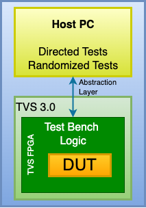
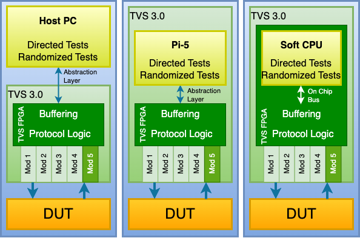
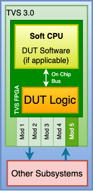

The Use-Cases
=============
This section highlights multiple ways in which the TVS 3.0 can be used.  These use-cases fall into two categories, DUT verification and DUT emulation.

Core-Level Development and Verification
---------------------------------------
For complex digital cores that are developed in-house, running thorough test benches in simulation can take costly amounts of time.  This is further exacerbated when constrained random testing is needed to obtain high levels of functional coverage.  In these situations, the TVS 3.0 contains a large FPGA (AMD Artix UltraScale+ XCAU25P-2FFVB676E) that can be used to implement your complex digital core (DUT) along with synthesizable parts of the test bench, allowing tests to run orders of magnitude faster than simulation.  However, when bugs are found using the accelerated test bench, they can easily be recreated in simulation for efficient debugging.  See :ref:`tvs_concept` to understand how the abstraction layer shown in the diagram below is used to accomplish this.

Card-Level Development and Verification
---------------------------------------
In this use-case, the TVS 3.0 interfaces to the DUT as shown in the diagram below.  The modules used in the TVS mainframe are selected to support the needs of the DUT.  The TVS FPGA implements the protocols of the DUT's interfaces.  The test scripts, which run on either a host computer, the built-in Pi-5, or a soft-CPU in the TVS FPGA, verify that the DUT meets its design requirements and operates properly under all scenarios, normal and anomolous.

Card Design Prototyping
-----------------------
The prototyping use-case is intended to develop and mature the design of the DUT by providing a flexible platform for making quick changes, interfacing with external sub-systems, and proving out new concepts and ideas.

If your DUT contains an FPGA that is smaller than an AMD Artix UltraScale+ XCAU25P-2FFVB676E, you can prototype it using a TVS 3.0.  The available modules can be used to connect your prototype design to external interfaces and your other DUT card devices may be modeled in the TVS FPGA or a custom-designed module.  The diagram below shows an example block diagram.

Card Design Emulation
---------------------
When your DUT interfaces to other cards or subsystems, the TVS 3.0 allows you to functionally emulate your design on a platform that may be far cheaper than the real article.  This is especially true in the space industry where flight designs use screened radiation tolerant parts that cost much more than their commercial counterparts.

Since the TVS 3.0 allows users to design their own modules, users can implement their circuits (in part or in whole) on one or more TVS 3.0 modules.  DUT circuits can be split into multiple modules so that you can mature your design incrementally. The DUT's FPGA can be hosted in the TVS FPGA, allowing changes to be quickly deployed and tested with connected designs. 

.. image:: ../../images/use_cases/card-design-emulation.png
  :align: center
